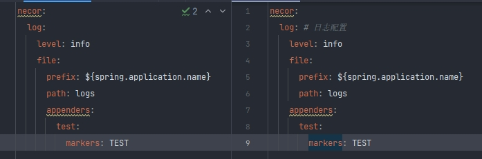

# Necor Logging Starter

Necor Logging Starter 是一个基于 Spring Boot 的自定义日志启动器，旨在简化和标准化日志配置。通过简单的配置，您可以快速集成并定制日志功能。

## 功能特性

- **统一日志配置**：通过标准化的配置格式，简化项目中的日志设置。
- **日志文件路径和前缀配置**：可自定义日志文件的存储路径和前缀。
- **日志级别配置**：支持全局日志级别的配置。
- **自定义日志输出**：支持自定义 appender，便于不同业务场景下的日志输出。
- **机器人PUSH消息**： 通过配置可让Lark机器人Push消息（依赖[necor-bot-starter](https://github.com/lx027688/necor-bot-starter)）

## 快速开始

### 引入依赖

在您的 `pom.xml` 文件中添加以下依赖：

```xml
<dependency>  
    <groupId>com.necor.log</groupId>  
    <artifactId>necor-logging-starter</artifactId>  
    <version>1.1.0</version>  
</dependency>  
```

### 配置文件

在 `application.yml` 或 `application.properties` 中添加以下配置：

```yml
spring:  
  application:  
    name: my-app  

necor:  
  log:  
    level: info # 设置全局日志级别为 info
    file:  
      prefix: ${spring.application.name} # 使用 my-app 作为日志文件前缀,默认为${spring.application.name}  
      path: logs # 将日志文件存储在logs, 默认为logs  
    appenders:  
      test: # 自定义日志附加器，日志将会${prefix}_test.log 命名  
        markers: TEST # 日志过滤器使用的 marker，用于日志分类。默认值为appender的名称，如：test。  
        filters: xxx.xx.Filter # 自定义过滤器，配置后默认使用的Filter不会生效。
        maxFileSize: 100 # 单天单个日志大小 单位M (默认100，最大1024*10)  
        maxHistory: 30 # 日志文件保留天数 (默认30，最大365*10)  
        pattern: "%d{yyyy-MM-dd HH:mm:ss.SSS} [%thread] %-5level %logger{50} - %msg%n" # 默认日志输出格式，可自定义  
        bot: # push 机器人
          lark: https://open.larksuite.com/open-apis/bot/v2/hook/xxxxxx 
```

### 使用示例

```java
// 普通使用
log.info("这是一个INFO消息");
log.warn("这是一个WARN消息");
log.error("这是一个ERROR消息");
log.debug("这是一个DEBUG消息");
// 使用自定义的appender，结合marker使用
log.info(NecorMarkerFactory.getMarker("TEST"), "这是一个Test日志");
```

#### 自定义 Appender

- **为什么自定义appender**

在实际开发中，对于某些日志需要特别关注，但在日志文件中往往会被大量的其它日志淹没掉，这时我们希望这些需要被特别关注的日志被保存在单独的日志文件中。

- **如何使用自定义appender**

如上述配置，可以自定义appender。上述配置中添加了一个名为`test` 的appender，该appender会输出包含 `TEST` marker 的日志并存入xxx_test.log的日志文件中。有多个marker使用`,`分开，marker默认为appender的名称，如上述配置的`test`。系统提供了名为API和BUSI的appender。

```java
Marker apiMarker = NecorMarkerFactory.getApiMarker();  
log.info(apiMarker, "api marker");  

Marker busiMarker = NecorMarkerFactory.getBusiMarker();  
log.info(busiMarker, "busi marker");  
```

除了设置`marker`以外，还可以自定义`Filter`，自定义Filter后，系统提供的Filter会失效。日志将不会输出到xxx_test.log文件中。

```java
import com.necor.log.filter.LogFilter;
import ch.qos.logback.core.spi.FilterReply;  

public class MyLogFilter extends LogFilter{  

    @Override  
    public FilterReply decide(ILoggingEvent event) {  
        if (event.getMarker() != null) {  
            if (event.getMarker().contains("TEST")) {  
                return FilterReply.ACCEPT;  
            }else {  
                return FilterReply.DENY;  
            }  
        }  
        return FilterReply.DENY;  
    }  
}  
```

如果某些日志需要预警，可以通过配置**bot**来实现。该功能依赖[necor-bot-starter](https://github.com/lx027688/necor-bot-starter)。

## 改动点

- 调整配置appenders结构


- 集成Lark PUSH消息功能

- 代码优化

## 贡献

欢迎提交问题和贡献代码！请通过 [GitHub issues](https://github.com/lx027688/necor-logging-starter/issues) 报告问题，或者提交 [Pull Request](https://github.com/lx027688/necor-logging-starter/pulls) 来贡献代码。

## 许可证

Necor Logging Starter 使用 [MIT](https://github.com/lx027688/necor-logging-starter/blob/master/LICENSEhttps://github.com/lx027688/necor-logging-starter/blob/master/LICENSE) 许可证 开源。

---

感谢使用 Necor Logging Starter。如果您有任何问题或建议，请随时联系我们。